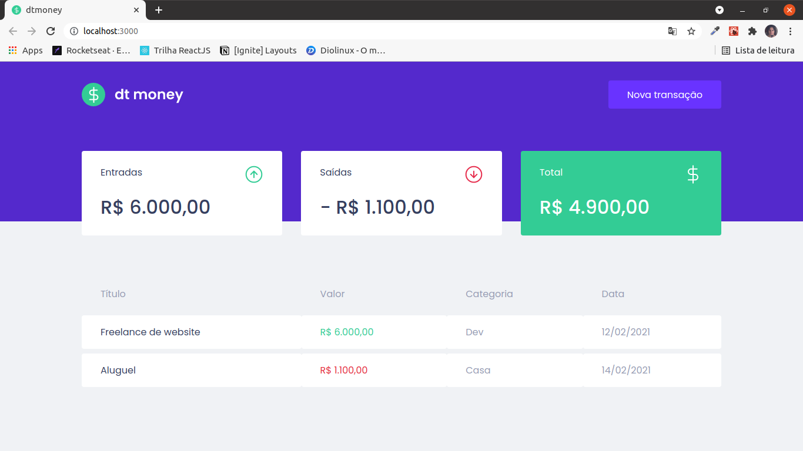
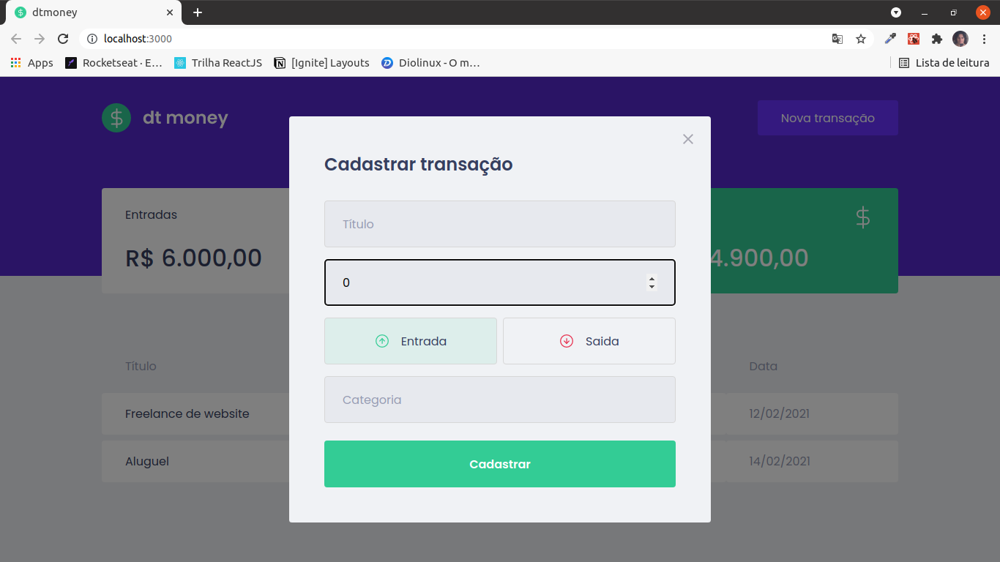

h1 align="center">
  
</h1>

## Primeiro Acesso
### Clonando o projeto
```
$ git clone https://github.com/matheusfd3/dtmoney.git
```
### Baixando as dependências
Na pasta do projeto execute o comando abaixo com o [Yarn](https://yarnpkg.com/lang/pt-br/).
```
$ yarn install
```
### Rodando no localhost
```
$ yarn start
```
Acesse [http://localhost:3000/](http://localhost:3000/).

## Páginas
### **Home**
<h2 align="center">
  
</h2>

### **Cadastrar Transação**
<h2 align="center">
  
</h2>